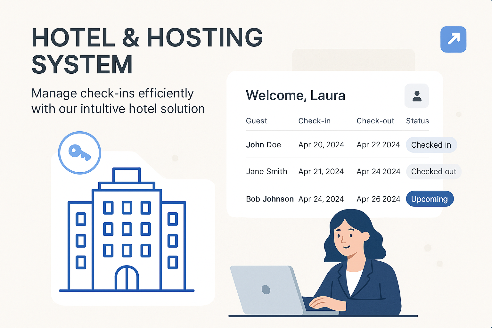

# 🏨 DIOHotel – Sistema de Hotelaria com OutSystems

## ✨ Visão Geral

Este projeto foi desenvolvido como parte do desafio prático da **DIO**, com o objetivo de criar um sistema de hotel e hospedagem moderno, funcional e intuitivo utilizando a plataforma **OutSystems**.

O **DIOHotel** é uma aplicação pensada para facilitar o gerenciamento de reservas, check-ins, check-outs e outros serviços essenciais de um ambiente hoteleiro. A proposta foi aprimorar a experiência do usuário, integrando usabilidade, eficiência e um toque de personalização.

## 🎯 Funcionalidades Implementadas

- **Página Inicial com Imagem de Destaque (Header)**  
  Layout aprimorado com uma imagem no topo, proporcionando uma interface mais agradável logo no primeiro contato do usuário.

- **Tela de Confirmação Estilizada**  
  Reformulada para oferecer uma experiência visual mais clara e elegante ao concluir ações importantes como reservas.

- **Área do Usuário (Profile) Reestruturada**  
  - Seção para exibição e edição dos dados pessoais.  
  - Seção com lista de reservas realizadas.  
  - Ao clicar em uma reserva, o usuário é redirecionado para uma tela com os detalhes do quarto e da reserva, com botão para retornar.

- **💡 Funcionalidade Extra (Opcional)**  
  Envio automático de e-mail de confirmação ao usuário após concluir uma reserva. *(Implementação com base em recursos nativos do OutSystems e documentação oficial.)*

## 🧠 Aprendizados

Este projeto permitiu explorar não apenas os fundamentos da plataforma OutSystems, mas também aprimorar a sensibilidade para design de interfaces e boas práticas em experiência do usuário. Ao mesmo tempo, foi uma oportunidade de aplicar lógica de programação orientada a componentes e desenvolver habilidades de deploy e versionamento.

## 🗂 Entrega

- Arquivo `.OML` com o projeto exportado diretamente do OutSystems.  
- Link para repositório no GitHub contendo este README, além de arquivos e recursos adicionais.

## 🚀 Como Executar

1. Importe o arquivo `.OML` para seu ambiente OutSystems.
2. Compile e publique o projeto.
3. Explore as funcionalidades e personalize conforme desejado!

---

Feito por mim, apaixonado em tecnologias de programação inovadoras e que vieram para facilitar a vida. Para empresas ou profissionais que valorizam desenvolvedores com iniciativa, visão de produto e foco no usuário, este projeto reflete exatamente essa mentalidade.

## 📋 Descrição

Descreva aqui o conteúdo desta seção.

## 📦 Instalação

Descreva aqui o conteúdo desta seção.

## 💻 Uso

Descreva aqui o conteúdo desta seção.

## 📄 Licença

Descreva aqui o conteúdo desta seção.

---

# 🏨 DIOHotel – Hotel System with OutSystems

## ✨ Overview

This project was developed as part of DIO's practical challenge, aiming to create a modern, functional, and intuitive hotel and hosting system using the **OutSystems** platform.

The **DIOHotel** is an application designed to facilitate the management of reservations, check-ins, check-outs, and other essential hotel services. The proposal was to enhance the user experience, integrating usability, efficiency, and a touch of personalization.

## 🎯 Implemented Features

- **Homepage with Hero Image (Header)**  
  Enhanced layout with a top image, providing a more pleasant interface right from the user's first contact.

- **Styled Confirmation Screen**  
  Redesigned to offer a clearer and more elegant visual experience when completing important actions such as reservations.

- **Restructured User Area (Profile)**  
  - Section for displaying and editing personal data.  
  - Section with a list of made reservations.  
  - By clicking on a reservation, the user is redirected to a screen with room and reservation details, with a button to return.

- **💡 Extra Feature (Optional)**  
  Automatic confirmation email sending to the user after completing a reservation. *(Implementation based on native OutSystems features and official documentation.)*

## 🧠 Learnings

This project allowed exploring not only the fundamentals of the OutSystems platform but also enhancing sensitivity for interface design and best practices in user experience. At the same time, it was an opportunity to apply component-oriented programming logic and develop deployment and versioning skills.

## 🗂 Deliverables

- `.OML` file with the project exported directly from OutSystems.  
- Link to GitHub repository containing this README, along with additional files and resources.

## 🚀 How to Run

1. Import the `.OML` file into your OutSystems environment.
2. Compile and publish the project.
3. Explore the functionalities and customize as desired!

---

Made by me, passionate about innovative programming technologies that came to make life easier. For companies or professionals who value developers with initiative, product vision, and user focus, this project reflects exactly this mindset.

## 📋 Description

Describe the content of this section here.

## 📦 Installation

Describe the content of this section here.

## 💻 Usage

Describe the content of this section here.

## 📄 License

Describe the content of this section here.

