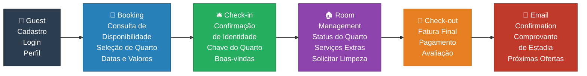
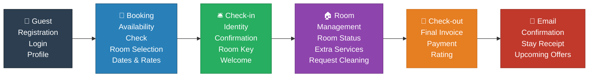

# 🏨 DIOHotel – Sistema de Hotelaria com OutSystems

<div align="center">


</div>

---

## 🇧🇷 Português

### ✨ Visão Geral

Este projeto foi desenvolvido como parte do desafio prático da **DIO**, com o objetivo de criar um sistema de hotel e hospedagem moderno, funcional e intuitivo utilizando a plataforma **OutSystems**.

O **DIOHotel** é uma aplicação pensada para facilitar o gerenciamento de reservas, check-ins, check-outs e outros serviços essenciais de um ambiente hoteleiro. A proposta foi aprimorar a experiência do usuário, integrando usabilidade, eficiência e um toque de personalização.

### 🏗️ Fluxo do Sistema Hoteleiro


```mermaid
flowchart LR
    A["👤 Guest\nCadastro\nLogin\nPerfil"] --> B["📅 Booking\nConsulta de\nDisponibilidade\nSeleção de Quarto\nDatas e Valores"]
    B --> C["🛎️ Check-in\nConfirmação\nde Identidade\nChave do Quarto\nBoas-vindas"]
    C --> D["🏠 Room\nManagement\nStatus do Quarto\nServiços Extras\nSolicitar Limpeza"]
    D --> E["🚪 Check-out\nFatura Final\nPagamento\nAvaliação"]
    E --> F["📧 Email\nConfirmation\nComprovante\nde Estadia\nPróximas Ofertas"]

    style A fill:#2c3e50,stroke:#1a252f,color:#fff
    style B fill:#2980b9,stroke:#1a5276,color:#fff
    style C fill:#27ae60,stroke:#1e8449,color:#fff
    style D fill:#8e44ad,stroke:#6c3483,color:#fff
    style E fill:#e67e22,stroke:#ca6f1e,color:#fff
    style F fill:#c0392b,stroke:#922b21,color:#fff
```

### 🎯 Funcionalidades Implementadas

- **Página Inicial com Imagem de Destaque (Header)**
  Layout aprimorado com uma imagem no topo, proporcionando uma interface mais agradável logo no primeiro contato do usuário.

- **Tela de Confirmação Estilizada**
  Reformulada para oferecer uma experiência visual mais clara e elegante ao concluir ações importantes como reservas.

- **Área do Usuário (Profile) Reestruturada**
  - Seção para exibição e edição dos dados pessoais.
  - Seção com lista de reservas realizadas.
  - Ao clicar em uma reserva, o usuário é redirecionado para uma tela com os detalhes do quarto e da reserva, com botão para retornar.

- **Gerenciamento de Quartos**
  - Visualização de status de quartos (disponível, ocupado, em limpeza).
  - Solicitação de serviços extras diretamente pelo sistema.
  - Controle de check-in e check-out com registro de data e hora.

- **Envio Automático de E-mail de Confirmação**
  Envio automático de e-mail de confirmação ao usuário após concluir uma reserva, implementado com recursos nativos do OutSystems.

### 🧠 Aprendizados

Este projeto permitiu explorar não apenas os fundamentos da plataforma OutSystems, mas também aprimorar a sensibilidade para design de interfaces e boas práticas em experiência do usuário. Ao mesmo tempo, foi uma oportunidade de aplicar lógica de programação orientada a componentes e desenvolver habilidades de deploy e versionamento.

### 📦 Instalação

Para instalar e testar o sistema, siga os passos:

1. Clone este repositório para sua máquina local:
   ```bash
   git clone https://github.com/galafis/Criando-um-Sistema-para-Hotel-e-Hospedagem-com-OutSystems.git
   ```
2. Importe o arquivo `.OML` para seu ambiente OutSystems (Service Studio).
3. Compile e publique o projeto no Service Center.
4. Configure as credenciais de e-mail no ambiente para ativar o envio automático de confirmações.

### 💻 Uso

Após a instalação e publicação:

1. Acesse o sistema pelo navegador ou dispositivo móvel.
2. Cadastre-se ou faça login com suas credenciais.
3. Consulte a disponibilidade de quartos e realize sua reserva.
4. Acompanhe o status de check-in, serviços do quarto e check-out pelo painel do usuário.
5. Receba automaticamente o e-mail de confirmação com os detalhes da estadia.

### 🗂 Entrega

- Arquivo `.OML` com o projeto exportado diretamente do OutSystems.
- Link para repositório no GitHub contendo este README, além de arquivos e recursos adicionais.

### 🚀 Como Executar

1. Importe o arquivo `.OML` para seu ambiente OutSystems.
2. Compile e publique o projeto.
3. Explore as funcionalidades e personalize conforme desejado.

### 📄 Licença

Este projeto está licenciado sob a licença MIT. Veja o arquivo `LICENSE` para mais detalhes.

---

# 🏨 DIOHotel – Hotel System with OutSystems

<div align="center">


</div>

## 🇺🇸 English

### ✨ Overview

This project was developed as part of DIO's practical challenge, aiming to create a modern, functional, and intuitive hotel and hosting system using the **OutSystems** platform.

The **DIOHotel** is an application designed to facilitate the management of reservations, check-ins, check-outs, and other essential hotel services. The proposal was to enhance the user experience, integrating usability, efficiency, and a touch of personalization.

### 🏗️ Hotel System Flow


```mermaid
flowchart LR
    A["👤 Guest\nRegistration\nLogin\nProfile"] --> B["📅 Booking\nAvailability\nCheck\nRoom Selection\nDates & Rates"]
    B --> C["🛎️ Check-in\nIdentity\nConfirmation\nRoom Key\nWelcome"]
    C --> D["🏠 Room\nManagement\nRoom Status\nExtra Services\nRequest Cleaning"]
    D --> E["🚪 Check-out\nFinal Invoice\nPayment\nRating"]
    E --> F["📧 Email\nConfirmation\nStay Receipt\nUpcoming Offers"]

    style A fill:#2c3e50,stroke:#1a252f,color:#fff
    style B fill:#2980b9,stroke:#1a5276,color:#fff
    style C fill:#27ae60,stroke:#1e8449,color:#fff
    style D fill:#8e44ad,stroke:#6c3483,color:#fff
    style E fill:#e67e22,stroke:#ca6f1e,color:#fff
    style F fill:#c0392b,stroke:#922b21,color:#fff
```

### 🎯 Implemented Features

- **Homepage with Hero Image (Header)**
  Enhanced layout with a top image, providing a more pleasant interface right from the user's first contact.

- **Styled Confirmation Screen**
  Redesigned to offer a clearer and more elegant visual experience when completing important actions such as reservations.

- **Restructured User Area (Profile)**
  - Section for displaying and editing personal data.
  - Section with a list of made reservations.
  - By clicking on a reservation, the user is redirected to a screen with room and reservation details, with a button to return.

- **Room Management**
  - Visual status overview of rooms (available, occupied, cleaning).
  - Request extra services directly through the system.
  - Check-in and check-out control with date and time logging.

- **Automatic Confirmation Email**
  Automatic confirmation email sent to the user after completing a reservation, implemented using native OutSystems features.

### 🧠 Learnings

This project allowed exploring not only the fundamentals of the OutSystems platform but also enhancing sensitivity for interface design and best practices in user experience. At the same time, it was an opportunity to apply component-oriented programming logic and develop deployment and versioning skills.

### 📦 Installation

To install and test the system, follow these steps:

1. Clone this repository to your local machine:
   ```bash
   git clone https://github.com/galafis/Criando-um-Sistema-para-Hotel-e-Hospedagem-com-OutSystems.git
   ```
2. Import the `.OML` file into your OutSystems environment (Service Studio).
3. Compile and publish the project in Service Center.
4. Configure email credentials in the environment to enable automatic confirmation sending.

### 💻 Usage

After installation and publication:

1. Access the system through a browser or mobile device.
2. Register or log in with your credentials.
3. Check room availability and make a reservation.
4. Track check-in status, room services, and check-out through the user dashboard.
5. Automatically receive a confirmation email with stay details.

### 🗂 Deliverables

- `.OML` file with the project exported directly from OutSystems.
- Link to GitHub repository containing this README, along with additional files and resources.

### 🚀 How to Run

1. Import the `.OML` file into your OutSystems environment.
2. Compile and publish the project.
3. Explore the functionalities and customize as desired.

---

Made with passion for innovative programming technologies that simplify everyday operations. For companies or professionals who value developers with initiative, product vision, and user focus, this project reflects exactly that mindset.

### 📄 License

This project is licensed under the MIT License. See the `LICENSE` file for more details.

---

## 📞 Contato | Contact

**GitHub**: [@galafis](https://github.com/galafis)


---

## English

### Overview

🏨 DIOHotel – Sistema de Hotelaria com OutSystems - A project built with HTML, CSS, OutSystems, developed by Gabriel Demetrios Lafis as part of professional portfolio and continuous learning in Data Science and Software Engineering.

### Key Features

This project demonstrates practical application of modern development concepts including clean code architecture, responsive design patterns, and industry-standard best practices. The implementation showcases real-world problem solving with production-ready code quality.

### How to Run

1. Clone the repository:
   ```bash
   git clone https://github.com/galafis/Criando-um-Sistema-para-Hotel-e-Hospedagem-com-OutSystems.git
   ```
2. Follow the setup instructions in the Portuguese section above.

### License

This project is licensed under the MIT License. See the [LICENSE](LICENSE) file for details.

---

Developed by [Gabriel Demetrios Lafis](https://github.com/galafis)
